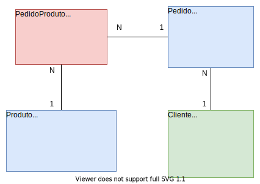

# Sistema de ~~Perdido~~ Pedido
Uma API RestFul muito simples para gerenciar pedidos feita em NodeJS

## Alguns Requisitos Funcionais
- Só preciso saber `quem` pediu e onde `pediu`;
- Que `dia` foi pedido e se foi `entregue`;
- Um pedido pode ter `varios` produtos;
- Um pedido so pode ser realizado se `houver` produto no `estoque` [:heavy_multiplication_x:] 
- Quando um novo pedido for feito, deve ser informado o `preço total` do pedido
- O preço `total do pedido` de definido pelo somatorio do preço de cada produto vezes a quantidade do produto no pedido.  

## Modelo


## EndPoint

### Clientes
- [GET] http://localhost:3333/cliente - Listar todos os clientes

### Produtos
- [GET] http://localhost:3333/produto - Listar todos os produtos

### Pedidos
- [GET] http://localhost:3333/pedido - listar todos os pedidos
- [POST] http://localhost:3333/pedido - criar um novo pedido
- [GET] http://localhost:3333/pedido/:id - listar um pedido por id
- [PUT] http://localhost:3333/pedido/:id - alterar um pedido por id (quantidade dos produtos ou status)
- [DELETE] http://localhost:3333/pedido/:id - remover um pedido por id

## Banco de dados

### Criar Tabelas
```
$ npm run knex:migrate
```

### Criar Dados iniciais
Os dados dos clientes é dos produtos são inseridos usando dados ficticios. 
```
$ npm run knex:seed
```

### Executar o servidor em DEV
```
$ npm run dev
```